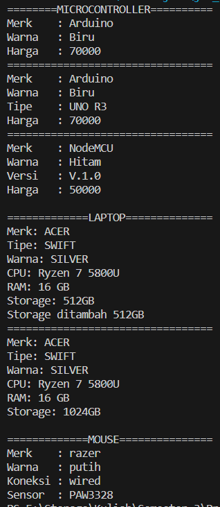

# **Nama : Lukman Eka Septiawan**
# **Kelas : 2E**
# **Mata Kuliah : Object Oriented Programming**

# **Percobaan 1**
```java
class sepeda
public class Sepeda {
    private String merek;
    private int kecepatan;
    private int gear;

    public void setMerek(String newValue) {
        merek = newValue;
    }

    public void gantiGear(int newValue) {
        gear = newValue;
    }

    public void tambahKecepatan(int increment) {
        kecepatan = kecepatan + increment;
    }

    public void rem(int decrement) {
        kecepatan = kecepatan - decrement;
    }

    public void cetakStatus() {
        System.out.println("Merek: " + merek);
        System.out.println("kecepatan: " + kecepatan);
        System.out.println("Gear: " + gear);
    }
}
```
# **class sepedaDemo**
```java
public class SepedaDemo {
    public static void main(String[] args) {
        Sepeda spd1 = new Sepeda();
        Sepeda spd2 = new Sepeda();

        spd1.setMerek("Polygon");
        spd1.tambahKecepatan(10);
        spd1.gantiGear(2);
        spd1.cetakStatus();

        spd2.setMerek("Wiim Cycle");
        spd2.tambahKecepatan(10);
        spd2.gantiGear(2);
        spd2.tambahKecepatan(10);
        spd2.gantiGear(3);
        spd2.cetakStatus();
    }
}
```

# **hasil**


# **Percobaan 2**
# **class sepedaGunung**
```java
public class SepedaGunung extends Sepeda {
    private String tipeSuspensi;

    public void setTipeSuspensi(String newValue) {
        tipeSuspensi = newValue;
    }

    public void cetakStatus() {
        super.cetakStatus();
        System.out.println("Tipe suspensi: " + tipeSuspensi);
    }
}
```
# **class sepedaDemo**
```java
public class SepedaDemo {
    public static void main(String[] args) {
        Sepeda spd1 = new Sepeda();
        Sepeda spd2 = new Sepeda();
        SepedaGunung spd3 = new SepedaGunung();

        spd1.setMerek("Polygon");
        spd1.tambahKecepatan(10);
        spd1.gantiGear(2);
        spd1.cetakStatus();

        spd2.setMerek("Wiim Cycle");
        spd2.tambahKecepatan(10);
        spd2.gantiGear(2);
        spd2.tambahKecepatan(10);
        spd2.gantiGear(3);
        spd2.cetakStatus();

        spd3.setMerek("Klinee");
        spd3.tambahKecepatan(5);
        spd3.gantiGear(7);
        spd3.setTipeSuspensi("Gas Suspension");
        spd3.cetakStatus();
    }
}
```
# **hasil**


# **Pertanyaan**
1. Jelaskan perbedaan antara objek dengan class!
Jawaban : Objek adalah rangkaian dalam program yang terdiri dari state dan behaviour. Sedangkan class adalah blueprint atau prototype dari objek atau bisa diartikan sebagai kerangka dari objek.

2. Jelaskan alasan warna dan tipe mesin dapat menjadi atribut dari objek mobil!
Jawaban : Karena warna dan tipe mesin dapat membedakan mobil satu dengan mobil yang lain dan setiap warna dan tipe mesin mobil tidak hanya dipasang pada satu mobil saja.

3. Sebutkan salah satu kelebihan utama dari pemrograman berorientasi objek dibandingkan dengan pemrograman struktural!
Jawaban : Program akan lebih fleksibel jika ada perubahan fitur, berbeda dengan pemrograman struktural menggunakan fungsi.

4. Apakah diperbolehkan melakukan pendefinisian dua buah atribut dalam satu baris kode seperti “public String nama,alamat;”?
Jawaban : Pendefinisian dua buah atribut dalam satu baris kode diperbolehkan.

5. Pada class SepedaGunung, jelaskan alasan atribut merk, kecepatan, dan gear tidak lagi ditulis di dalam class tersebut! 
Jawaban : Karena merek, kecepatan, dan gear sudah terdapat pada class Sepeda dan pada fungsi cetakStatus yang ada pada class SepedaGunung juga dilakukan pemanggilan cetakStatus yang ada pada class Sepeda.


# **Tugas**

# **class Demo**
```java
public class Demo {
    public static void main(String[] args) {
        Laptop lp = new Laptop();
        Mouse d = new Mouse();
        Microcontroll mc = new Microcontroll();
        Arduino a = new Arduino();
        NodeMCU n = new NodeMCU();

        System.out.println("========MICROCONTROLLER==========");
        mc.tambahMC("Arduino", "Biru", 70000);
        mc.cetakMC();
        System.out.println("Harga\t: " + mc.getHarga());
        System.out.println("=================================");
        a.tambahMC("Arduino", "Biru", 70000);
        a.setTipe("UNO R3");
        a.printA();
        System.out.println("Harga\t: " + mc.getHarga());
        System.out.println("=================================");
        n.tambahMC("NodeMCU", "Hitam", 50000);
        n.setVersi("1.0");
        n.printN();
        System.out.println("Harga\t: " + n.getHarga());

        System.out.println();
        System.out.println("=============LAPTOP==============");
        lp.tambahLaptop("ACER", "SWIFT", "SILVER", "Ryzen 7 5800U", 16, 512);
        lp.tampilL();
        lp.tambahStorage(512);
        lp.tampilL();

        System.out.println();
        System.out.println("=============MOUSE===============");
        d.tambahMouse("razer", "putih", "wired", "PAW3328");
        d.tampilM();
        System.out.println("Sensor\t: " + d.getSensor());
    }
}
```

# **class Mouse**
```java
public class Mouse {
    private String merk;
    private String warna;
    private String koneksi;
    private String sensor;

    public void tambahMouse(String m, String w, String k, String s) {
        merk = m;
        warna = w;
        koneksi = k;
        sensor = s;
    }

    public void tampilM() {
        System.out.println("Merk\t: " + merk + "\nWarna\t: " + warna + "\nKoneksi\t: " + koneksi);
    }

    public String getSensor() {
        return sensor;
    }
}
```


# **class Laptop**
```java
public class Laptop {
    private String merk;
    private String tipe;
    private String warna;
    private String cpu;
    private int ram;
    private int storage;

    public void tambahLaptop(String m, String t, String w, String pc, int r, int s) {
        merk = m;
        tipe = t;
        warna = w;
        cpu = pc;
        ram = r;
        storage = s;
    }

    public void tampilL() {
        System.out.println(
                "Merk: " + merk + "\nTipe: " + tipe + "\nWarna: " + warna + "\nCPU: " + cpu + "\nRAM: " + ram +
                        " GB\nStorage: " + storage + "GB");
    }

    public void tambahStorage(int tambah) {
        storage += tambah;
        System.out.println("Storage ditambah " + tambah + "GB");
        System.out.println("=================================");
    }

}
```


# **class Microcontroll**
```java
public class Microcontroll {
    private String merk;
    private String warna;
    private int harga;

    public void tambahMC(String merk, String warna, int harga) {
        this.merk = merk;
        this.warna = warna;
        this.harga = harga;
    }

    public void cetakMC() {
        System.out.println("Merk\t: " + merk + "\nWarna\t: " + warna);
    }

    public int getHarga() {
        return harga;
    }
}
```

# **class Arduino**
```java
public class Arduino extends Microcontroll {
    private String tipe;

    public void setTipe(String tipe) {
        this.tipe = tipe;
    }

    public void printA() {
        super.cetakMC();
        System.out.println("Tipe\t: " + tipe);
    }
}
```


# **class NodeMCU**
```java
public class NodeMCU extends Microcontroll {
    private String versi;

    public void setVersi(String versi) {
        this.versi = versi;
    }

    public void printN() {
        super.cetakMC();
        System.out.println("Versi\t: V." + versi);
    }
}
```


# **hasil**
