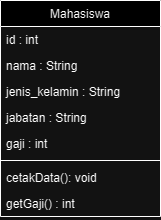
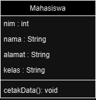
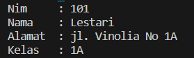
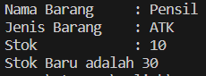
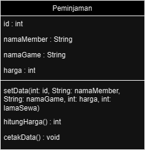
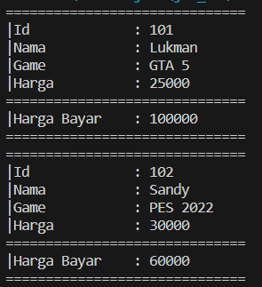
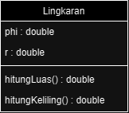
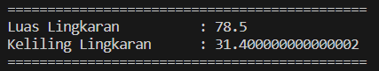
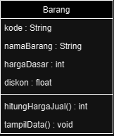
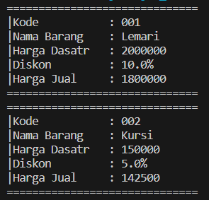

# **Nama : Lukman Eka Septiawan**
# **Kelas : 2E**
# **Mata Kuliah : Object Oriented Programming**

<br>

# **Percobaan 1**

Studi Kasus 1
<p>Dalam suatu perusahaan salah satu data yang diolah adalah data karyawan. Setiap karyawan memiliki id, nama, jenis kelamin, jabatan, jabatan, dan gaji. Setiap mahasiswa juga bisa menampilkan data diri pribadi dan melihat gajinya.

<p>1. Gambarkan desain class diagram dari studi kasus 1!
<p>Jawaban</p>


<p>2. Sebutkan Class apa saja yang bisa dibuat dari studi kasus 1!,
<p>Jawaban: Class yang dapat dibuat dari studi kasus yang ada adalah Karyawan.
<p>3. Sebutkan atribut beserta tipe datanya yang dapat diidentifikasi dari masing-masing class dari studi kasus 1!
<P>Jawaban: Id:int, Nama:String, Jenis_Kelamin:String, Jabatan:String, Gaji:int

<p>4. Sebutkan method-method yang sudah anda buat dari masing-masing class pada studi kasus 1!
<p>Jawaban: cetakData():void, getGaji():int

<br>

# **Percobaan 2**
Studi Kasus 2
<p>Perhatikan class diagram dibawah ini. Buatlah program berdasarkan class diagram tersebut!</p>

<p>Langkah Kerja</p>
<p>1. Bukalah text editor atau IDE, misalnya Notepad ++ / netbeans.
<p>2. Ketikkan kode program berikut ini:
<p>3. Simpan dengan nama file Mahasiswa.java.
<p>4. Untuk dapat mengakses anggota-anggota dari suatu obyek, maka harus dibuat instance dari class tersebut terlebih dahulu. Berikut ini adalah cara pengaksesan anggota-anggota dari class Mahasiswa dengan membuka file baru kemudian ketikkan kode program berikut:
<p>5. Simpan file dengan TestMahasiswa.java
<p>6. Jalankan class TestMahasiswa
<p>7. Jelaskan pada bagian mana proses pendeklarasian atribut pada program diatas!
<p>Jawaban: Pendeklarasian atribut dilakukan pada class Mahasisawa. code:

```java
public int nim;
public String nama;
public String alamat;
public String kelas;
```

<p>8. Jelaskan pada bagian mana proses pendeklarasian method pada program diatas!
<p>Jawaban: Pada kasus ini pendeklarasian method terletak pada class Mahasiswa. code: 

```java
public void tampilBiodata() {
        System.out.println("Nim\t: " + nim);
        System.out.println("Nama\t: " + nama);
        System.out.println("Alamat\t: " + alamat);
        System.out.println("Kelas\t: " + kelas);
    }
```

<p>9. Berapa banyak objek yang di instansiasi pada program diatas!
<p>Jawaban: Objek yang diinstansiasi ada sebanyak 1 objek

```java
Mahasiswa mhs1 = new Mahasiswa();
```

<p>10. Apakah yang sebenarnya dilakukan pada sintaks program “mhs1.nim=101” ?
<p>Jawaban: Sintaks tersebut berfungsi untuk memasukkan nilai pada variabel nim yang berada pada class Mahasiswa menggunakan objek mhs1.
<p>11. Apakah yang sebenarnya dilakukan pada sintaks program “mhs1.tampilBiodata()” ?
<p>Jawaban: Sintaks tersebut dilakukan untuk menampilkan data yang ada pada class Mahasiswa dengan cara memanggil method yang memanfaatkan objek mhs1.
<p>12. Instansiasi 2 objek lagi pada program diatas!</p>
<p>Jawaban: 

```java
Mahasiswa mhs1 = new Mahasiswa();
Mahasiswa mhs2 = new Mahasiswa();
Mahasiswa mhs3 = new Mahasiswa();
```

<p>class Mahasiswa

```java
    public class Mahasiswa {
    public int nim;
    public String nama;
    public String alamat;
    public String kelas;

    public void tampilBiodata() {
        System.out.println("Nim\t: " + nim);
        System.out.println("Nama\t: " + nama);
        System.out.println("Alamat\t: " + alamat);
        System.out.println("Kelas\t: " + kelas);
    }
}
```
<p>class TestMahasiswa

```java
    public class TestMahasiswa {
    public static void main(String[] args) {
        Mahasiswa mhs1 = new Mahasiswa();
        mhs1.nim = 101;
        mhs1.nama = "Lestari";
        mhs1.alamat = "jl. Vinolia No 1A";
        mhs1.kelas = "1A";
        mhs1.tampilBiodata();
    }
}
```
<p>Hasil



<br>

# **Percobaan 3**
1. Bukalah text editor atau IDE, misalnya Notepad ++ / netbeans.
2. Ketikkan kode program berikut ini:
3. Simpan dengan nama file Barang.java
4. Untuk dapat mengakses anggota-anggota dari suatu obyek, maka harus dibuat instance dari class tersebut terlebih dahulu. Berikut ini adalah cara pengaksesan anggota-anggota dari class Barang dengan membuka file baru kemudian ketikkan kode program berikut:
5. Simpan dengan nama file TestBarang.java
6. Jalankan program tersebut!
7. Apakah fungsi argumen dalam suatu method?
<p>Jawaban: Argumen pada suatu method berfungsi untuk mengirimkan data dari method main ke method lainnya baik di satu class atau di luar class main.

8. Ambil kesimpulan tentang kegunaan dari kata kunci return , dan kapan suatu method harus memiliki return!
<p>Jawaban: return berfungsi untuk mengembalikan nilai yang sudah diproses di dalam suatu method untuk dipanggil pada method atau class lain.

<p>class Barang

```java
public class Barang {
    public String namaBrg;
    public String jenisBrg;
    public int stok;

    public void tampilBarang() {
        System.out.println("Nama Barang\t: " + namaBrg);
        System.out.println("Jenis Barang\t: " + jenisBrg);
        System.out.println("Stok\t\t: " + stok);
    }

    // method dengan argumen dan nilai balik (return)
    public int tambahStok(int brgMasuk) {
        int stokBaru = brgMasuk + stok;
        return stokBaru;
    }
}
```

<p>classTestBarang

```java
public class TestBarang {
    public static void main(String[] args) {
        Barang brg1 = new Barang();
        brg1.namaBrg = "Pensil";
        brg1.jenisBrg = "ATK";
        brg1.stok = 10;
        brg1.tampilBarang();
        // menampilkan dan mengisi argumen untk menambahkan stok barang
        System.out.println("Stok Baru adalah " + brg1.tambahStok(20));
    }
}
```

<p>Hasil



<br>

# **Tugas**
1. Suatu toko persewaan video game salah satu yang diolah adalah peminjaman, dimana data yang dicatat ketika ada orang yang melakukan peminjaman adalah id, nama member, nama game, dan harga yang harus dibayar. Setiap peminjaman bisa menampilkan data hasil peminjaman dan harga yang harus dibayar. Buatlah class diagram pada studi kasus diatas!
<p>Penjelasan
<li>Harga yang harus dibayar diperoleh dari lama sewa x harga.
</li>
<li>Diasumsikan 1x transaksi peminjaman game yang dipinjam hanya 1 game saja.</li>
<br>


2. Buatlah program dari class diagram yang sudah anda buat di no 1!
<p>class Peminjaman

```java
public class Peminjaman {
    private int id;
    private String namaMember;
    private String namaGame;
    private int harga;
    private int hargaBayar;

    public void setData(int id, String member, String game, int harga, int lamaSewa) {
        this.id = id;
        this.namaMember = member;
        this.namaGame = game;
        this.harga = harga;
        this.hargaBayar = hitungHarga(harga, lamaSewa);
    }

    public int hitungHarga(int harga, int lamaSewa) {
        return lamaSewa * harga;
    }

    public void cetakData() {
        System.out.println("==============================");
        System.out.println("|Id\t\t: " + id);
        System.out.println("|Nama\t\t: " + namaMember);
        System.out.println("|Game\t\t: " + namaGame);
        System.out.println("|Harga\t\t: " + harga);
        System.out.println("==============================");
        System.out.println("|Harga Bayar\t: " + hargaBayar);
        System.out.println("==============================");
    }
}
```

<p>class DemoPeminjaman

```java
public class DemoPeminjaman {
    public static void main(String[] args) {
        Peminjaman pj = new Peminjaman();

        pj.setData(101, "Lukman", "GTA 5", 25000, 4);
        pj.cetakData();
        pj.setData(102, "Sandy", "PES 2022", 30000, 2);
        pj.cetakData();
    }
}
```

<p>Hasil



3. Buatlah program sesuai dengan class diagram berikut ini:


<p>class Lingkaran

```java
public class Lingkaran {
    private double phi = 3.14;
    private double r;

    public void setR(double r) {
        this.r = r;
    }

    public double hitungLuas() {
        return phi * Math.pow(r, 2);
    }

    public double hitungKeliling() {
        return 2 * phi * r;
    }
}
```

<p>class DemoLingkaran

```java
public class DemoLingkaran {
    public static void main(String[] args) {
        Lingkaran l = new Lingkaran();

        l.setR(5);
        System.out.println("=============================================");
        System.out.println("Luas Lingkaran\t\t: " + l.hitungLuas());
        System.out.println("Keliling Lingkaran\t: " + l.hitungKeliling());
        System.out.println("=============================================");
    }
}
```

<p>Hasil



4. Buatlah program sesuai dengan class diagram berikut ini:

<p>Deskripsi/Penjelasan:</p>
<li>Nilai atribut hargaDasar dalam Rupiah dan atribut diskon dalam %</li>
<li>Method hitungHargaJual() digunakan untuk menghitung harga jual dengan perhitungan berikut ini:</li>
<p>harga jual = harga dasar - (diskon x harga dasar)
<li>Method tampilData() digunakan untuk menampilkan nilai dari kode, namaBarang, hargaDasar, diskon dan harga jual.</li>

<p>class Barang

```java
package tugas;

public class Barang {
    private String kode;
    private String namaBarang;
    private int hargaDasar;
    private float diskon;

    public void setBarang(String kode, String barang, int harga, float diskon) {
        this.kode = kode;
        this.namaBarang = barang;
        this.hargaDasar = harga;
        this.diskon = diskon;
    }

    public int hitungHargaJual() {
        return (int) (hargaDasar - ((diskon / 100) * hargaDasar));
    }

    public void tampilData() {
        System.out.println("==============================");
        System.out.println("|Kode\t\t: " + kode);
        System.out.println("|Nama Barang\t: " + namaBarang);
        System.out.println("|Harga Dasatr\t: " + hargaDasar);
        System.out.println("|Diskon\t\t: " + diskon + "%");
        System.out.println("|Harga Jual\t: " + hitungHargaJual());
        System.out.println("==============================");
    }
}
```

<p>class DemoBarang

```java
package tugas;

public class DemoBarang {
    public static void main(String[] args) {
        Barang b = new Barang();

        b.setBarang("001", "Lemari", 2000000, 10);
        b.tampilData();
        b.setBarang("002", "Kursi", 150000, 5);
        b.tampilData();
    }
}
```

<p>Hasil

